## **nGrinder接口性能测试指南**

#### **1.nGrinder 环境准备主要包含**（JDK1.8.152 以上版本 和nGrinder安装包)已经有一键部署安装包具体下载地址如下:链接https://yunzhihui.feishu.cn/drive/folder/fldcnFyLmeEx6qACZLYoh2za3Se，下载nGrinderServer.tar.gz

#### **2.将下载后的文件上传至Jenkins部署机器**（用于压测）指定目录下，如 /home/ghuser（执行 sudo su 获取root权限）

执行    **tar -xvzf nGrinderServer.tar.gz && cd nGrinderServer && sh ./Autoinstall.sh**

安装完成后 通过执行 ps -ef|grep "tomcat"  确认nGrinder 服务是否安装成功；如下图

执行ss -tnlp |grep 80 如下图-安装成功

**备注：1.一键安装包会试图安装Agent，因目前在本次Demo环境会安装失败，请安装下面步骤手动安装（非root用户，通过sudo  su 获取roo't 权限；**

**2.默认Tomcat端口为80端口**，如果冲突，Tomcat应该会启动失败，通过/nGrinderServer/apache-tomcat-9.0.36/conf/server.xml 配置文件修改为可用端口，如下图所示

端口修改后，执行 **nGrinderServer/nGrinderStart.sh**脚本重新启动nGrinder,启动成功后检查方法同上面

#### **3.启动成功后，通过本地浏览器访问(demo)**

 如： http://jenkins部署机器IP或域名（如果端口不是80，请带上指定端口）

出现如下页面，输入用户名和密码，默认为admin/admin

**登录成功后**

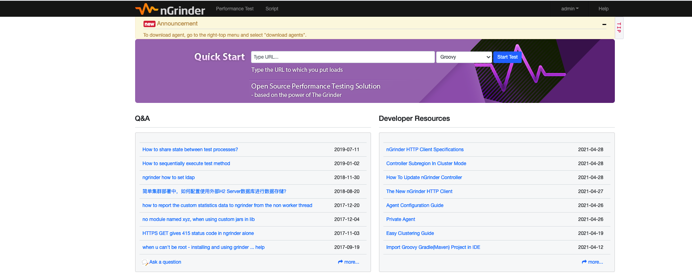

#### 4.**检查Agent是否安装成功，**如下图所示

#### 5.**安装Agent**，

#####    a.修改 **/home/ghuser/nGrinderServer/ngrinder-agent/__agent.conf** 中的**agent.controller_host**参数,如本机域名地址：”“**krbumatp.chinanorth2.cloudapp.chinacloudapi.cn**” 如下图所示，修改成功后，保存并退出；

#####  **b.启动Agent    cd /home/ghuser/nGrinderServer/ngrinder-agent && sh ./run_agent_bg.sh** 

##### **c.执行  jps 或者ps -ef|grep java 查看Agent是否启动成功**

##### **d.agent 安装启动成功；**

#### **6.接口压测脚本开发**：

##### **a.按下图操作创建压测脚本**

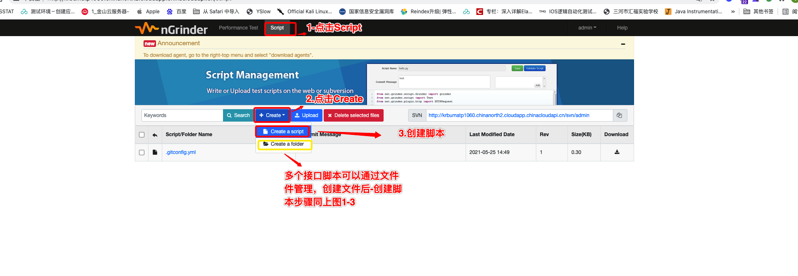

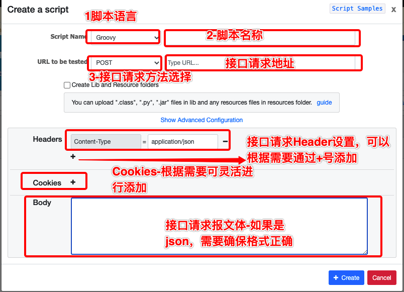

##### **b.本次样例：**

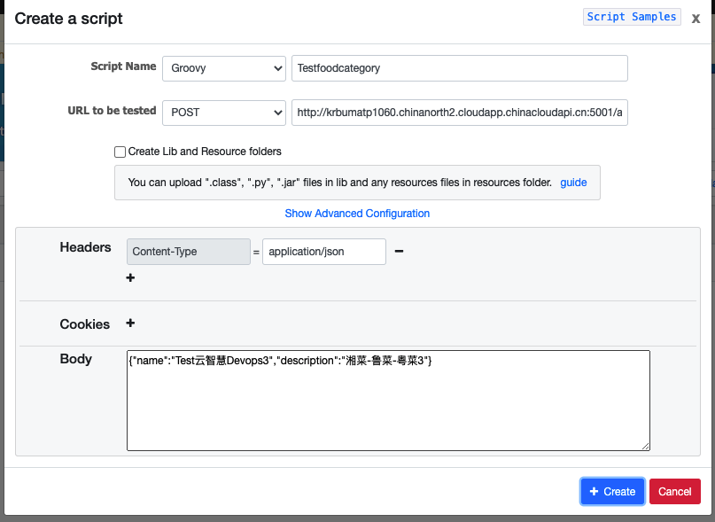

#####  **C.点击“Create” 按钮后**，进入下面脚本编辑和调试页面

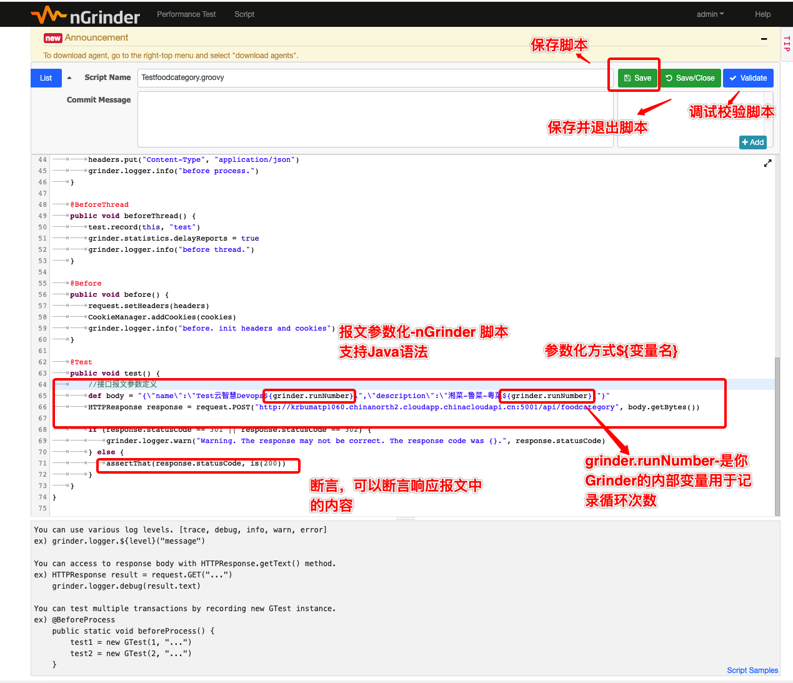

##### **d.脚本参数完成后-通过“validate” 进行脚本调试和验证，脚本验证成功后，才能进行创建场景进行压测**

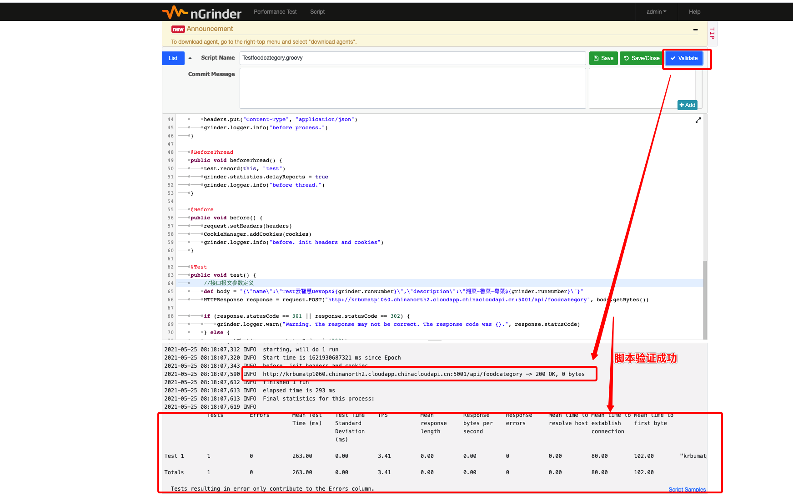

##### **e.创建场景，按下图操作**

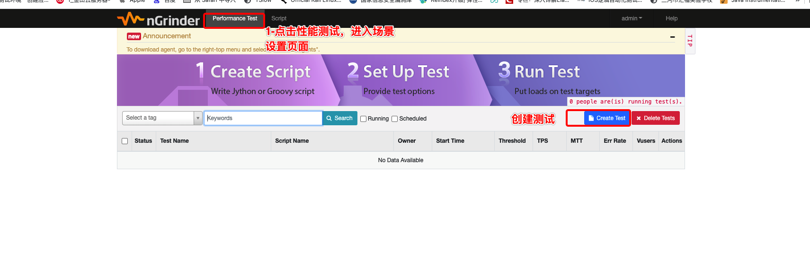

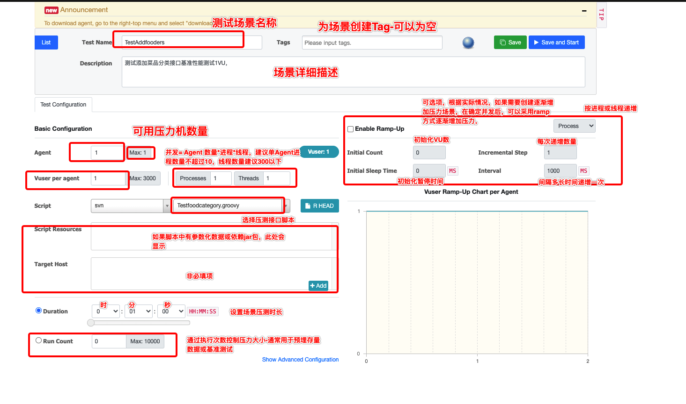

##### **f.根据上图将场景创建完毕后，点击 "SAVA and Start" 按钮，如下图所示，（选择立即执行）**

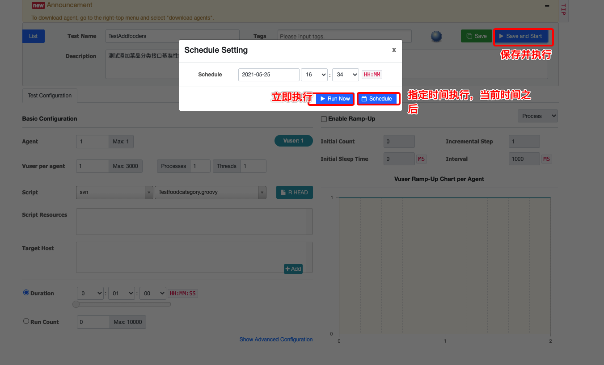

##### **g.压测场景启动成功后，如下图所示，会显示执行时间，TPS，响应时间等信息**

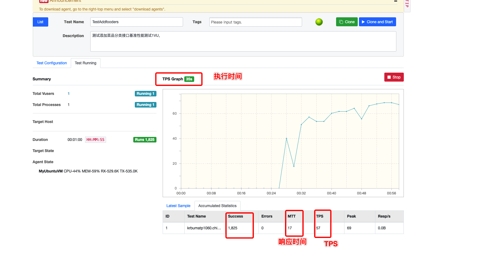

##### **h.场景执行成功结束后，如下图所示，可以点击“detailed Report” 查看详细报告**

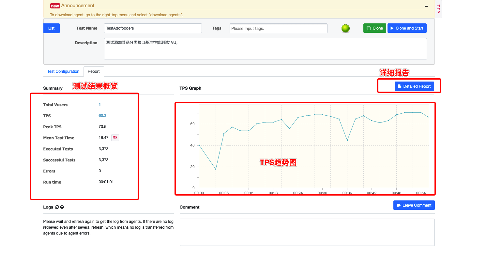

#####  **i详细报告如下：**

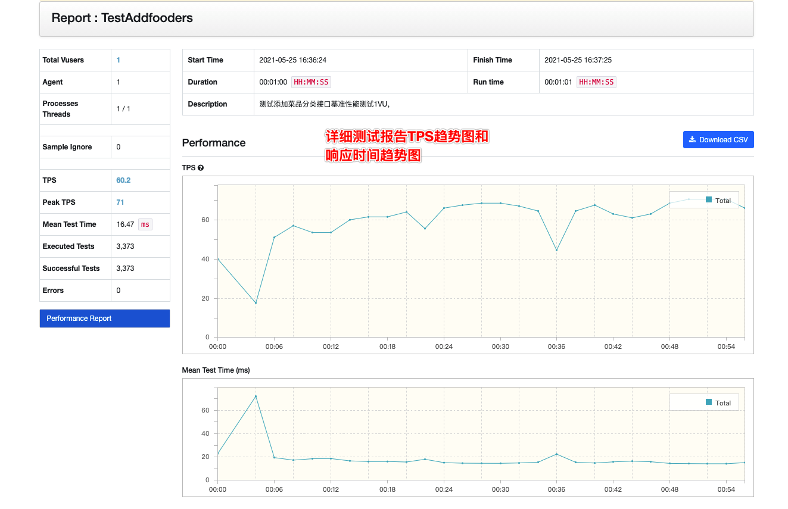

##### **附件：本次样例脚本：**

import static net.grinder.script.Grinder.grinder
import static org.junit.Assert.*
import static org.hamcrest.Matchers.*
import net.grinder.script.GTest
import net.grinder.script.Grinder
import net.grinder.scriptengine.groovy.junit.GrinderRunner
import net.grinder.scriptengine.groovy.junit.annotation.BeforeProcess
import net.grinder.scriptengine.groovy.junit.annotation.BeforeThread
// import static net.grinder.util.GrinderUtils.* // You can use this if you're using nGrinder after 3.2.3
import org.junit.Before
import org.junit.BeforeClass
import org.junit.Test
import org.junit.runner.RunWith

import org.ngrinder.http.HTTPRequest
import org.ngrinder.http.HTTPRequestControl
import org.ngrinder.http.HTTPResponse
import org.ngrinder.http.cookie.Cookie
import org.ngrinder.http.cookie.CookieManager

/**
* A simple example using the HTTP plugin that shows the retrieval of a single page via HTTP.
*
* This script is automatically generated by ngrinder.
*
* @author admin
  */
  @RunWith(GrinderRunner)
  class TestRunner {

  public static GTest test
  public static HTTPRequest request
  public static Map<String, String> headers = [:]
  //public static String body = "{\"name\":\"Test云智慧Devops3\",\"description\":\"湘菜-鲁菜-粤菜3\"}"
  public static List<Cookie> cookies = []

  @BeforeProcess
  public static void beforeProcess() {
  	HTTPRequestControl.setConnectionTimeout(300000)
  	test = new GTest(1, "krbumatp1060.chinanorth2.cloudapp.chinacloudapi.cn")
  	request = new HTTPRequest()

  	// Set header data
  	headers.put("Content-Type", "application/json")
  	grinder.logger.info("before process.")
  }

  @BeforeThread
  public void beforeThread() {
  	test.record(this, "test")
  	grinder.statistics.delayReports = true
  	grinder.logger.info("before thread.")
  }

  @Before
  public void before() {
  	request.setHeaders(headers)
  	CookieManager.addCookies(cookies)
  	grinder.logger.info("before. init headers and cookies")
  }

  @Test
  public void test() {
      //接口报文参数定义
  	def body = "{\"name\":\"Test云智慧Devops${grinder.runNumber}\",\"description\":\"湘菜-鲁菜-粤菜${grinder.runNumber}\"}"
  	HTTPResponse response = request.POST("http://krbumatp1060.chinanorth2.cloudapp.chinacloudapi.cn:5001/api/foodcategory", body.getBytes())
      

  	if (response.statusCode == 301 || response.statusCode == 302) {
  		grinder.logger.warn("Warning. The response may not be correct. The response code was {}.", response.statusCode)
  	} else {
  		assertThat(response.statusCode, is(200))
  	}
  }
  }