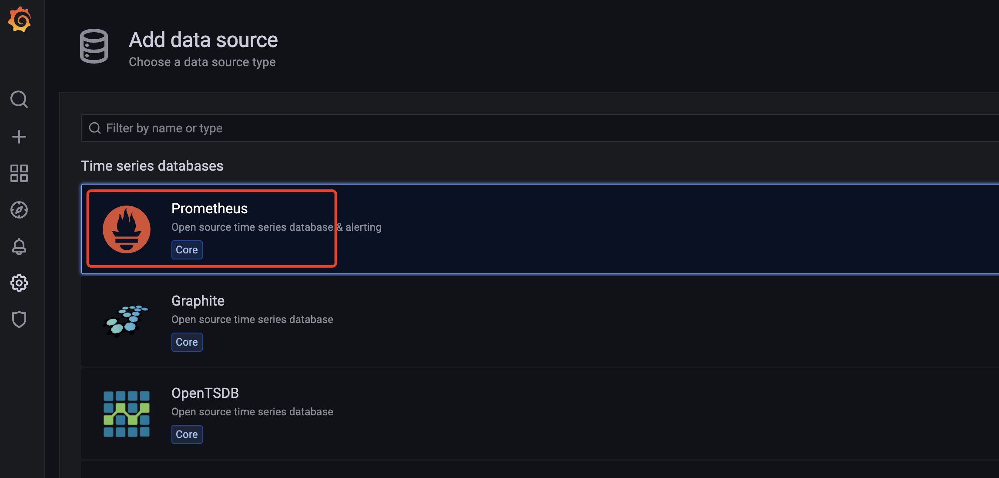
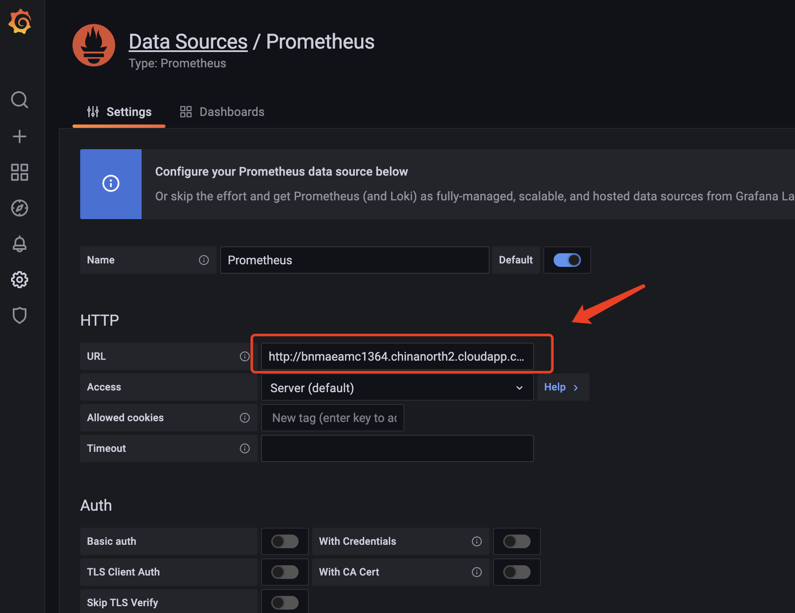
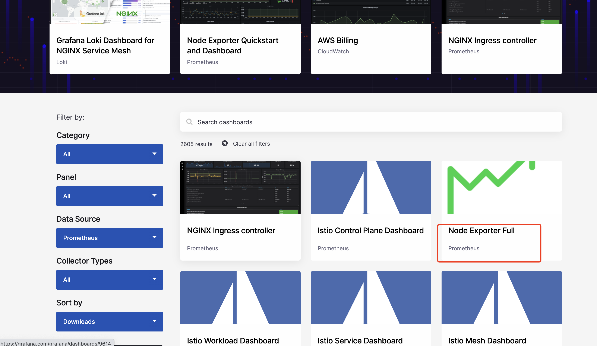
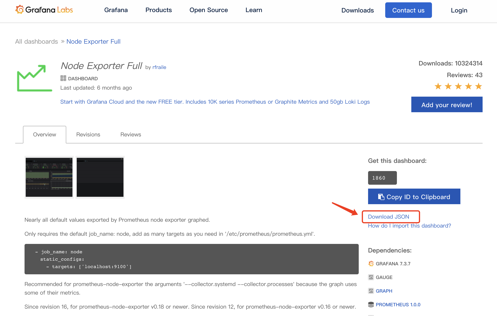
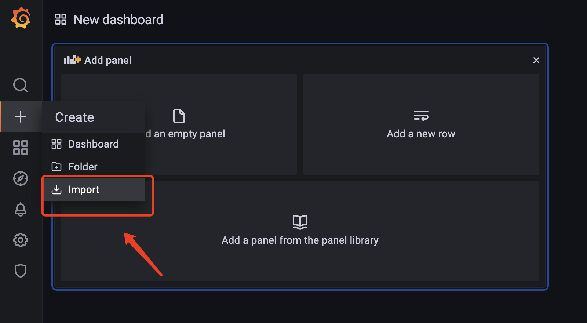
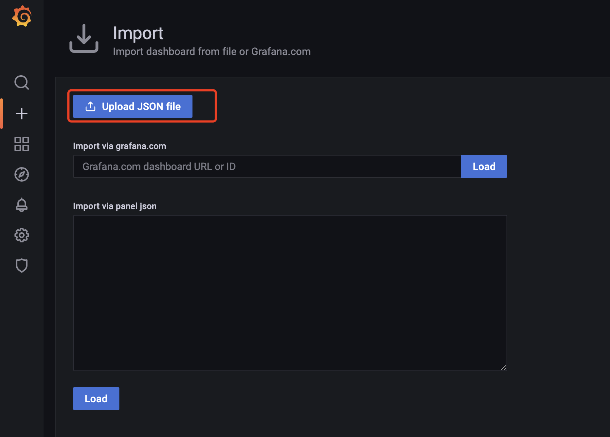
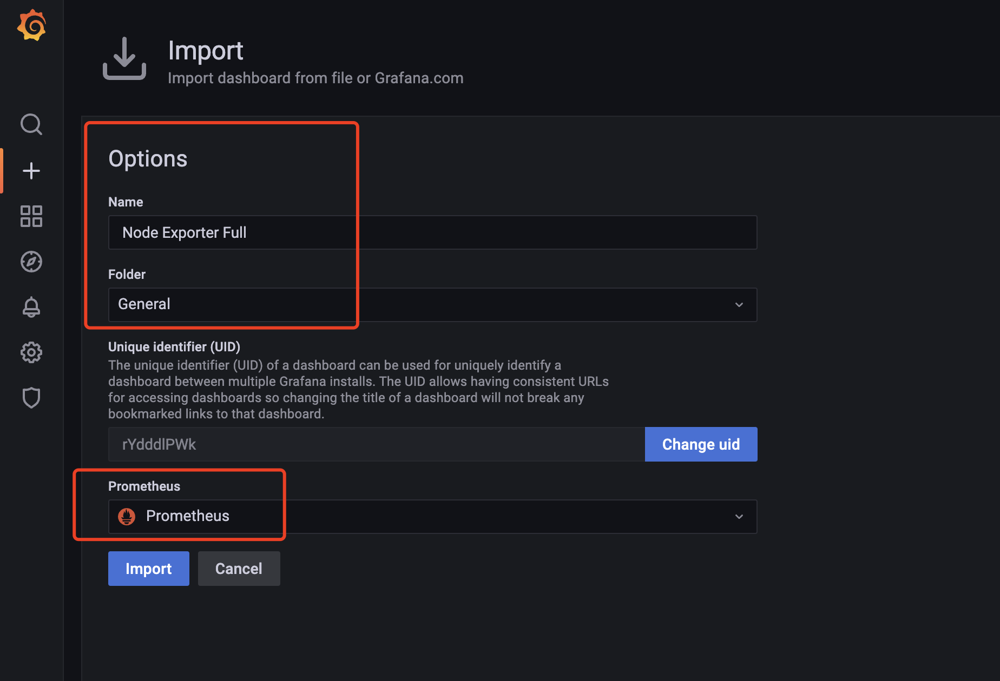
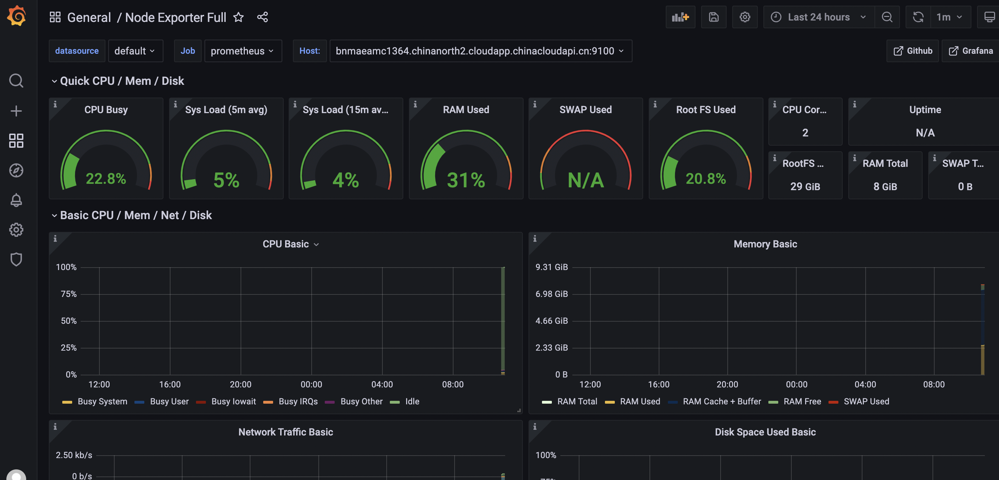
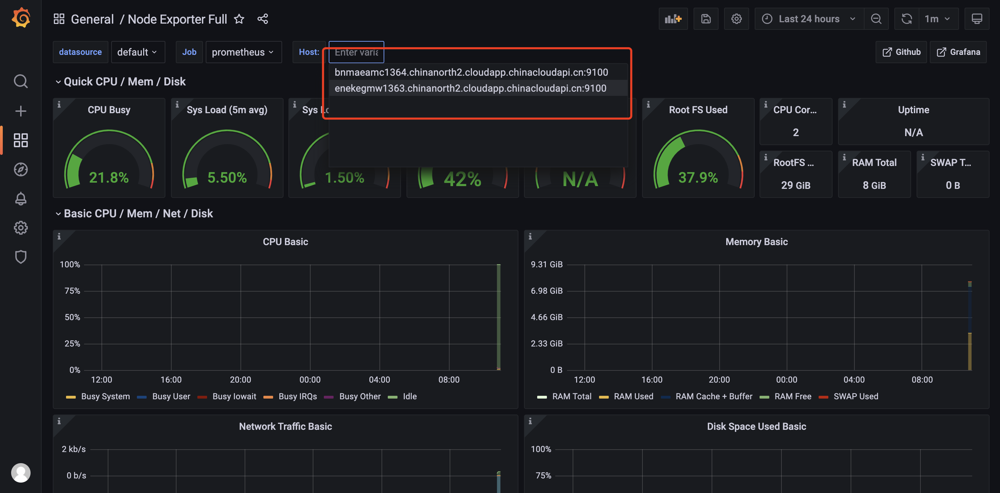

# 使用Prometheus+Grafana监控服务器以及容器


**背景介绍** ：

> 通过DevOps流水线可以快速完成应用的编译，测试，打包，部署。但是部署只有应用的监控以及服务器的监控，包括容器的监控也是非常重要的。我们需要监控服务器
的性能指标。避免服务出现down机的问题。

这文档提供了多种环境的监控，包括Windows，Linux，容器，Kubernetes集群等。
整个部署过程，包括四个组件：Prometheus Server、Node Exporter、cAdvrisor、Grafana。

|  组建名称 | 说明  |
| ------------ | ------------ |
|  Prometheus Server | Prometheus服务的主服务器   |
| Node Exporter  | 收集Host硬件和操作系统的信息  |
| cAdvrisor   |  负责收集Host上运行的容器信息 |
| Grafana    | 用来展示Prometheus监控操作界面（给我们提供一个友好的web界面）  |

## 01. 在Jenkins服务器上安装Node Exporter

> 通过在Jenkins服务器上安装Node Exporter，可以收集Jenkins服务器的系统运行情况，并通过Grafana监控服务器性能以及问题。

执行一下命令通过容器部署node-exporter

```
docker run -d -p 9100:9100 \
-v "/proc:/host/proc" \
-v "/sys:/host/sys" \
-v "/:/rootfs" \
prom/node-exporter \
--path.procfs /host/proc \
--path.sysfs /host/sys \
--collector.filesystem.ignored-mount-points "^/(sys|proc|dev|host|etc)($|/)"
```


## 02. 在Dev服务器上安装Node Exporter && Cadvisor 

> 在Dev服务器上安装Node Exporter，可以收集Jenkins服务器的系统运行情况，并通过Grafana监控服务器性能以及问题。

执行一下命令通过容器部署node-exporter

```
docker run -d -p 9100:9100 \
-v "/proc:/host/proc" \
-v "/sys:/host/sys" \
-v "/:/rootfs" \
prom/node-exporter \
--path.procfs /host/proc \
--path.sysfs /host/sys \
--collector.filesystem.ignored-mount-points "^/(sys|proc|dev|host|etc)($|/)"
```

执行一下命令通过容器部署Cadvisor


```
docker run -v /:/rootfs:ro -v /var/run:/var/run:rw -v /sys:/sys:ro -v /var/lib/docker:/var/lib/docker:ro -p 8081:8080 --detach=true --name=cadvisor google/cadvisor:latest
```


### 03. 在Jenkins服务器上安装Promethues主服务器

使用容器的方式启动prometheus服务。

```
docker run -d -p 9090:9090 --name prometheus prom/prometheus
```

复制Prometheus容器中的主配置文件到宿主机本地

```
sudo docker cp prometheus:/etc/prometheus/prometheus.yml /root/
```

删除临时创建的Prometheus容器

```
docker rm -f prometheus 
```

打开复制出来的配置文件，直接跳转到配置文件的最后一行

```
sudo vi /root/prometheus.yml 
```

修改Tagget服务器, 使用!wq保存更改

```
targets: ['jenkins-server:9100','dev-server:9100','dev-server:8081']
```

启动prometheus服务，并使用刚刚修改的配置文件

```
docker run -d -p 9090:9090 -v /root/prometheus.yml:/etc/prometheus/prometheus.yml --name prometheus prom/prometheus
```


### 04. 在Jenkins服务器上安装Grafana服务

> Grafana可以帮助我们可视化服务器的相关指标。

```
mkdir grafana-storage
chmod 777 -R grafana-storage/
docker run -d -p 3000:3000 --name grafana -v /root/grafana-storage:/var/lib/grafana -e "GF_SECURITY_ADMIN_PASSWORD=garafana" grafana/grafana

```

### 05. 查看Prometheus监控目标的情况

打开http://jenkins-server:9090, 点击Status ｜ targets 如下图所示：

> 说明：UP表明服务器正常，Down表示服务器没有监控到


### 06. 使用Grafana监控服务器性能


打开http://jenkins-server:3000, 并登陆Grafana，用户名：admin，密码：grafana

添加数据源，如下图所示：


选择Prometheus，如下图所示：



添加Prometheus的地址，打开http://jenkins-server:9090，并点击保存。如下图所示：




打开Grafana官网，https://grafana.com/grafana/dashboards/?dataSource=prometheus，下载监控模版，并导入：



点击Download Json，下载监控模版，如下图所示：



按下图操作方式，导入监控模版，如下图所示：




点击Upload Json File，如下图所示：



点击Import，如下图所示：



监控主机情况，如下图所示：



切换监控主机，如下图所示：



说明：这样我们就快速完成了服务器的监控，对于windows，容器，kubernetes服务器我们都可以通过安装exporter以及下载grafana监控模版来完成各种监控。