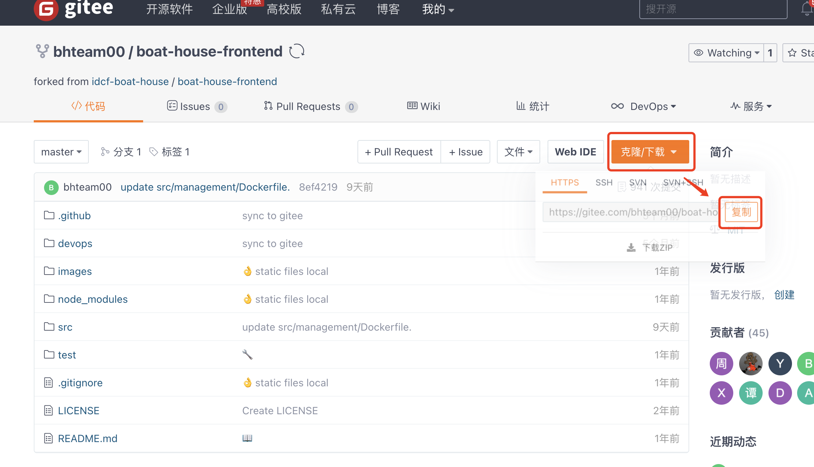
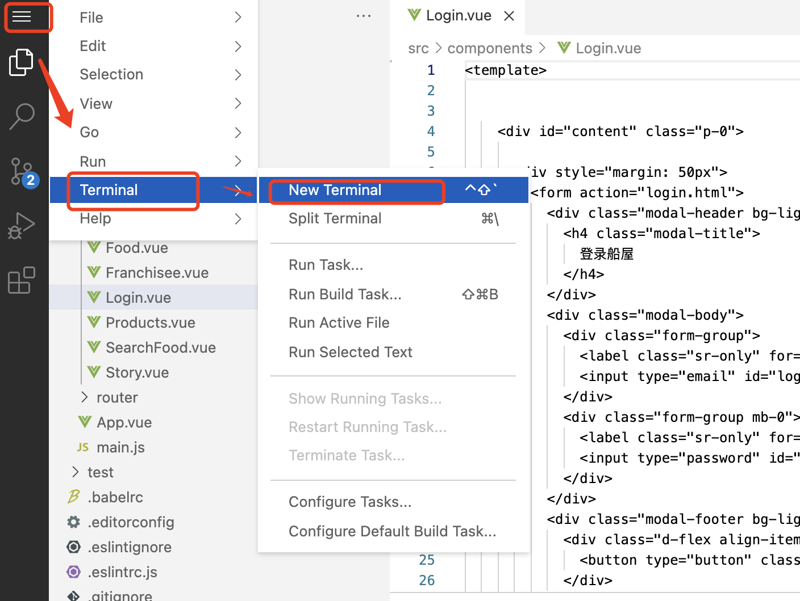
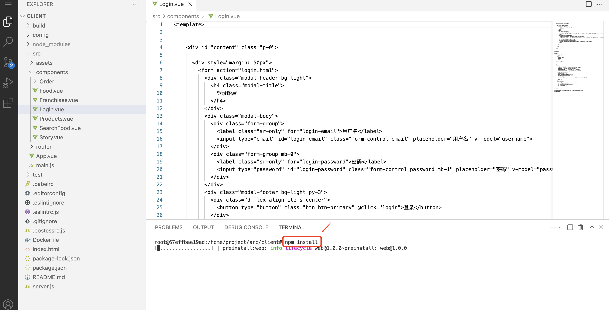

# 使用标准化容器化开发环境进行开发

**本文档介绍了以下内容** ：

目前很多团队已经公司都已经完成了运维端的容器化转型，通过Docker以及Kuberntes提供的能力，帮助团队快速完成应用的部署以及回滚。我们都能体会到
容器给运维端带来的好处，包括标准化部署环境，应用之间隔离，弹性伸缩等能力。但是对于开发端我们仍然面临着同样的问题。比如团队成员之前开发环境不一致
导致的各种问题，个体环境各种SDK版本不兼容等问题。现在很多互联网厂商已经意识到此问题，并试图通过容器化/云原生模式解决开发端的问题。
本章我们将通过开源容器化/云原生 开发工具smartide，完成boathouse前端nodejs项目的开发，调试。一下是云原生开发模式带来的好处。

- 标准化开发环境（开发人员不需要关注自己应该装什么版本的IDE，以及什么版本的Nodejs以及其他依赖，管理员会统一使用容器化镜像模版配置，为开发人员统一配置好开发，调测环境）
- 无需安装IDE（云原生模式的开发模式，开发人员无需在本地安装IDE以及SDK，只需要通过浏览器就可以完成应用的开发调试）
- 一键启动开发调试（开发人员只需要执行一个smartide start命令就可以直接开始应用的开发，不管你是Java开发人员还是C#，C++开发人员都可以轻松进入开发状态）


** 01. SmartIDE开发客户端安装**

请参考以下安装手册，完成smartide开发客户端的安装：

https://smartide.dev/zh/docs/getting-started/install/

 - Docker Desktop && Docker-Compose（已安装Docker用户可以跳过）
 - SmartIDE 命令行工具


** 02. 克隆代码到本地**

001. 打开小组成员已经Folk到自己团队的BoatHouse船屋餐厅前端的代码，参考下图复制代码仓库地址：



002. 打开命令行工具，并输入以下命令完成代码克隆,并进入到代码目录：

```
git clone <BoatHouse前端代码仓库地址>
cd boat-house-frontend
```

** 03. 启动标准容器化开发环境**

001. 执行以下命令启动容器化开发环境

```
smartide start
```

002. 执行完成后，输出如下：

注意：执行命令后会自动在云端拉取一个包含VSCode Web开发环境以及配置好的Nodejs开发环境。所以这个镜像会比较大，需要耐心等待一会。
拉取完成后会自动将代码映射到容器内，并自动通过浏览器打开开发环境。接下来就可以进入开发调试了。

```
yang@mac boat-house-frontend % smartide start
v0.1.6.992
2021-11-14 11:14:04.750 INFO  SmartIDE启动中......
2021-11-14 11:14:05.842 INFO  docker-compose 文件路径: /Users/zhouwenyang/idcf/boat-house-frontend/.ide/tmp/docker-compose-boathouse-frontend.yaml
2021-11-14 11:14:05.842 INFO  SSH转发端口：6822
Creating boat-house-frontend_boathouse-frontend_1 ... done
2021-11-14 11:14:06.548 INFO  打开浏览器......
2021-11-14 11:14:06.548 INFO  从浏览器中打开： http://localhost:6800/?folder=vscode-remote://localhost:6800/home/project
service            state   image                                                               ports
boathouse-frontend running registry.cn-hangzhou.aliyuncs.com/smartide/smartide-opvscode:latest 6822:22; 6800:3000; 8080:8080
2021-11-14 11:14:10.086 INFO  SmartIDE启动完毕
```

VScode Web IDE打开后，效果如下图所示：


003. 打开船物餐厅客户端代码目录：

点击File ｜ Open Folder ｜ 选择路径 /home/project/src/client/ ｜ 点击 OK，如下图所示：


** 04. 开发BoatHouse船物餐厅客户端 **

001. 点击 Terminal ｜ New Terminal，打开命令行工具，如下图所示：



002. 执行以下命令，完成npm依赖包的安装，如下图所示。

```
npm install
```



003. 执行以下命令，完成船屋餐厅前端的启动。

```
npm start
```


启动完成后，如下图所示：


004. 使用浏览器打开船屋应用：

http://localhost:8080

打开后如下图所示：

