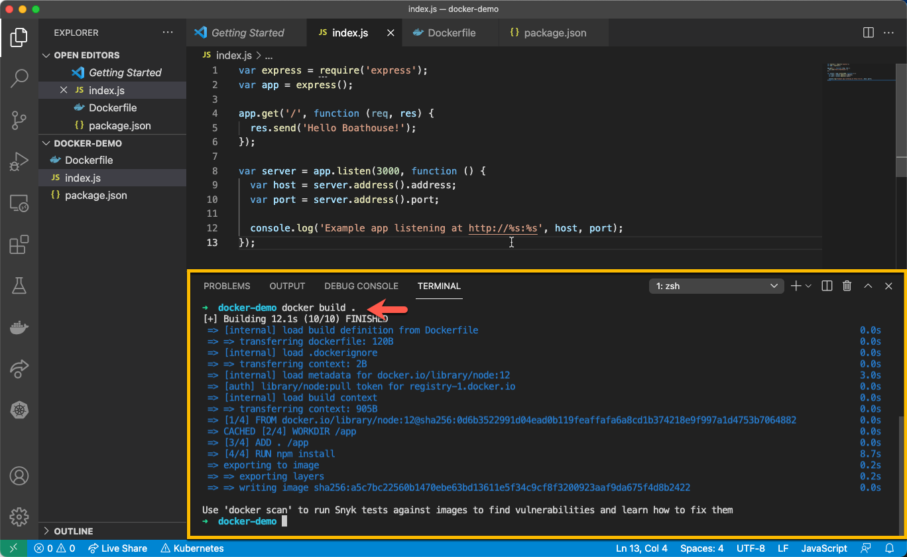
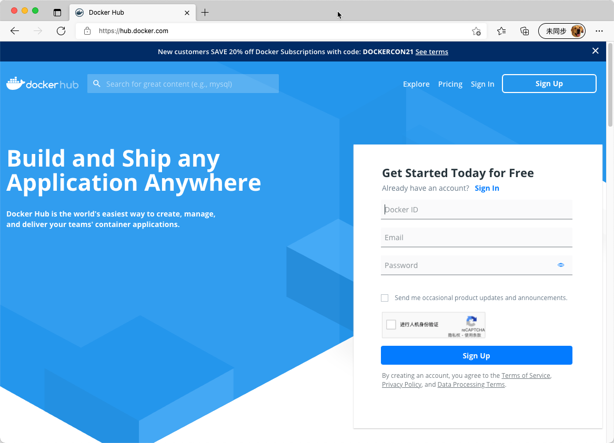
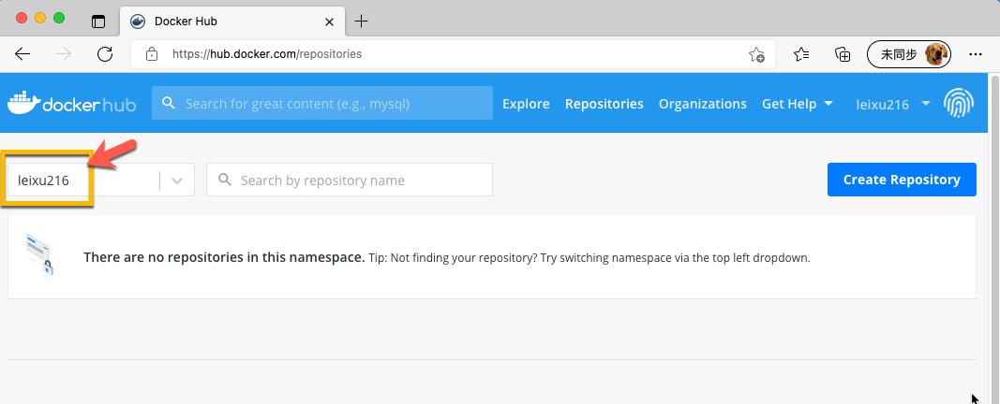
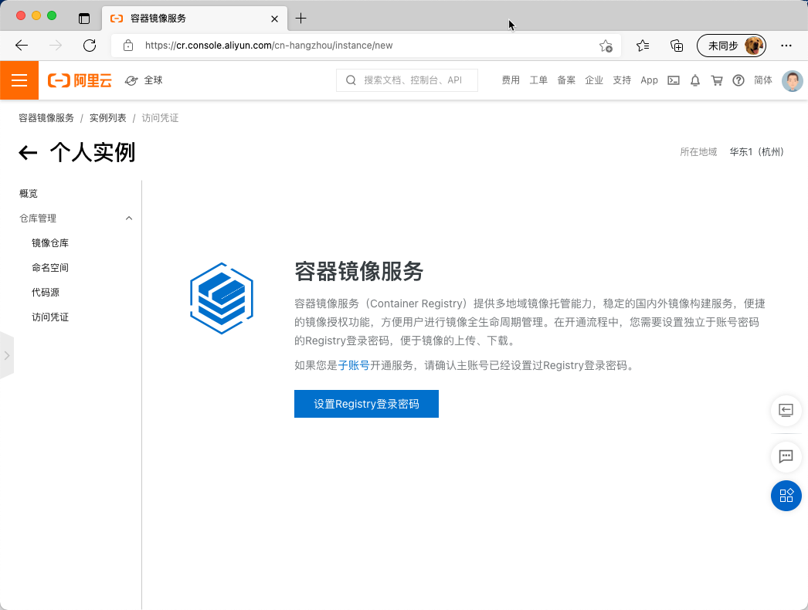
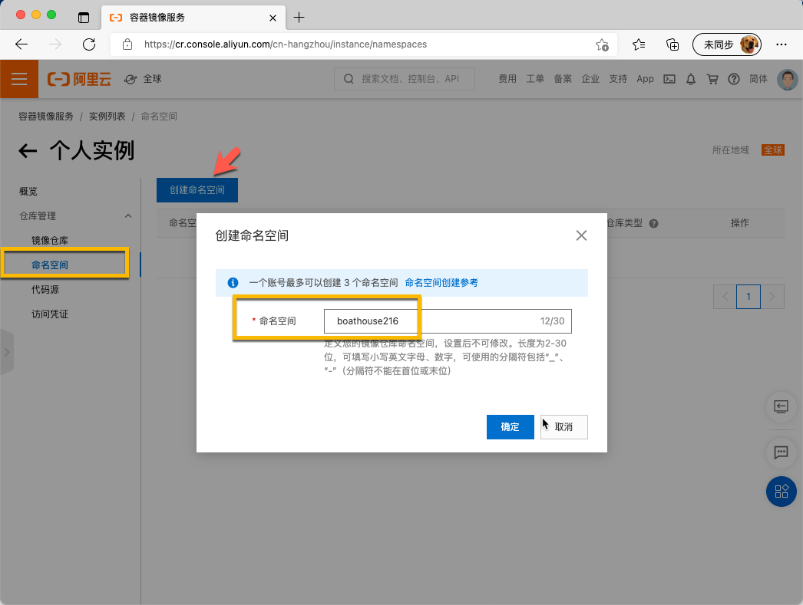
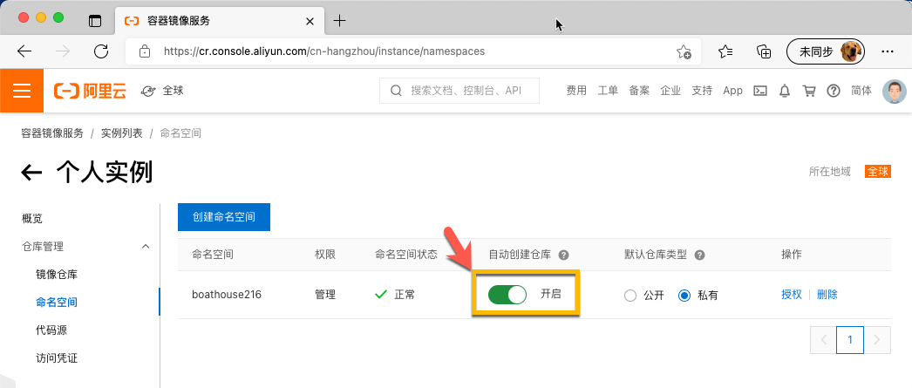
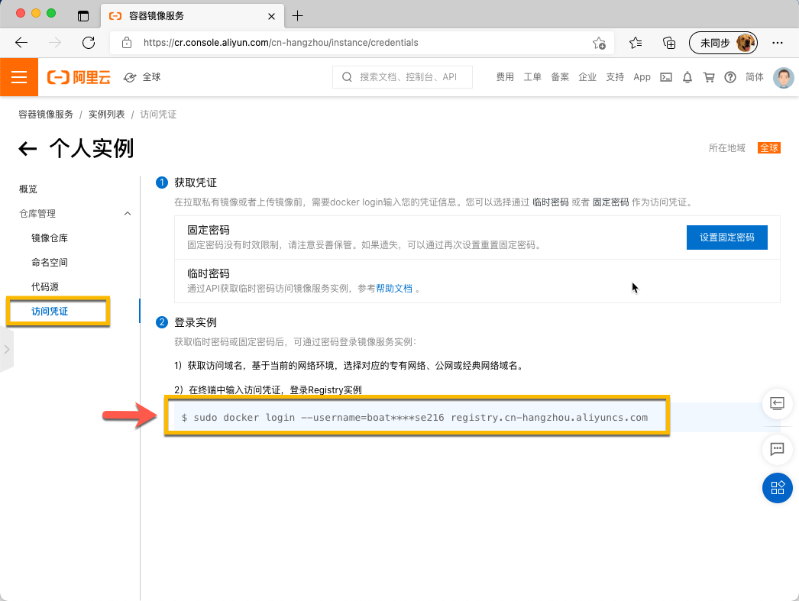
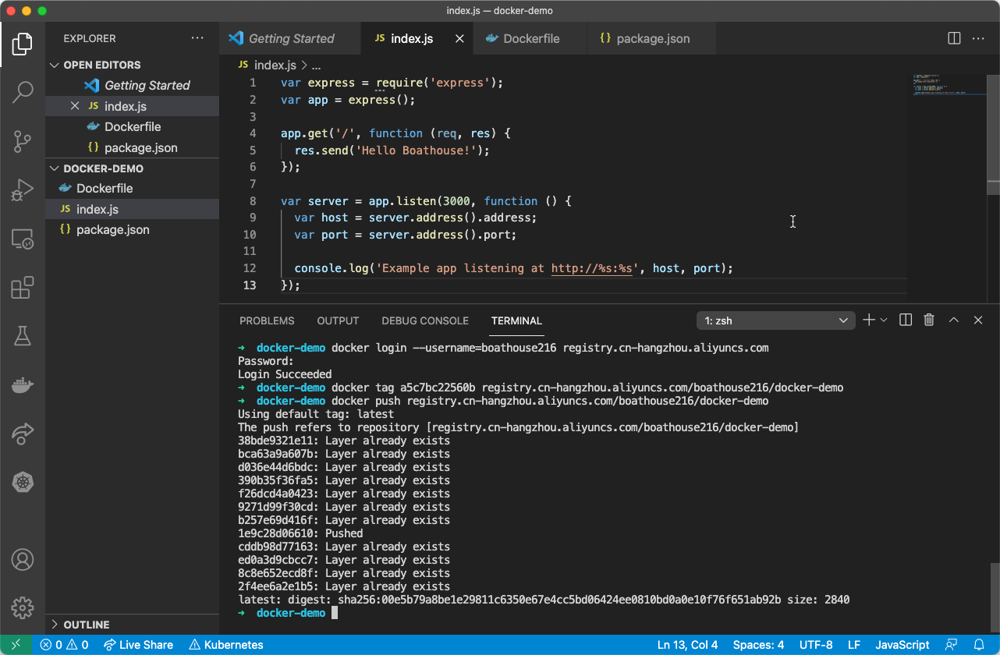
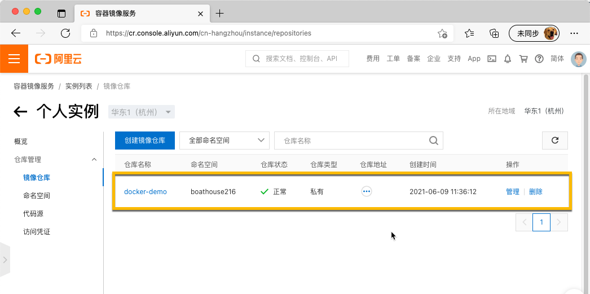
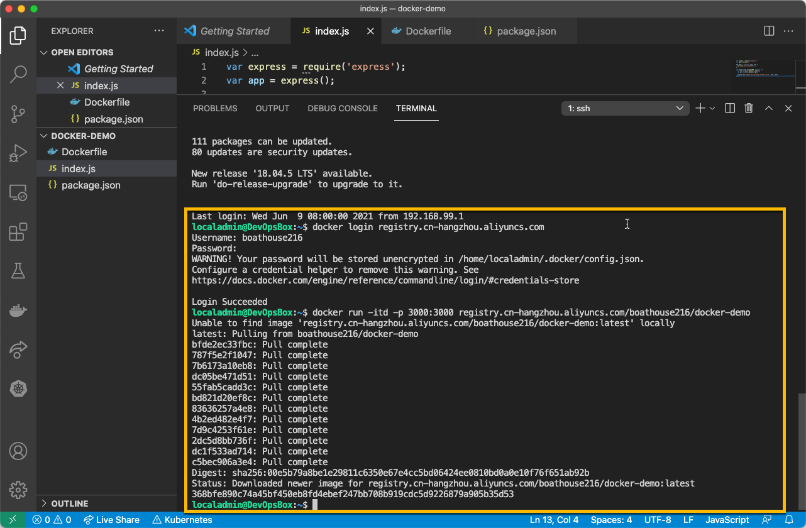

# BHOL302 - 应用的容器化开发全流程实践

本节实验中我们将完成一个应用的编码开发，容器化打包，上传镜像仓库，并在目标环境使用进行部署的全过程。

## 01 - 创建应用代码

使用以下命令创建代码目录并用vscode打开

```shell
mkdir docker-demo
cd docker-demo 
code .
```

使用vscode分别创建以下文件

- index.js
- Dockerfile
- package.json


将以下内容分别复制到对应的文件中

index.js - 这是我们的应用入口，其功能就是在网页中直接输出 Hello Boathouse！的字样

```javascript
var express = require('express');
var app = express();

app.get('/', function (req, res) {
  res.send('Hello Boathouse!');
});

var server = app.listen(3000, function () {
  var host = server.address().address;
  var port = server.address().port;

  console.log('Example app listening at http://%s:%s', host, port);
});
```

package.json - 这是 node.js 项目的配置文件，描述了本项目的依赖以及入口

```json
{
    "name": "myapp",
    "version": "0.0.1",
    "private": true,
    "scripts": {
      "start": "node index.js"
    },
    "engines": {
      "node": "^4.6.1"
    },
    "dependencies": {
      "express": "^4.14.0",
      "http-errors": "^1.7.0",
      "mysql": "^2.10.2"
    },
    "devDependencies": {
      "inherits": "^2.0.3",
      "mocha": "^5.2.0",
      "ms": "^2.1.1"
    }
}
```

Dockerfile - 用于 docker build 的打包脚本文件，我们基于node:12基础镜像，将应用代码复制到 /app 目录后执行 npm install，然后执行 package.json 中定义的应用入口 npm start 启动应用。

```Dockerfile
FROM node:12
WORKDIR /app
ADD . /app
RUN npm install
EXPOSE 3000
CMD npm start
```

## 02 - 使用 docker build 完成应用构建和打包

在vscode中通过菜单 Terminal | New Terminal 打开命令行，并执行以下命令

```shell
docker build .
```

输出如下



现在我们已经完成了应用构建和打包，可以运行这个镜像了

```shell
## 使用 docker images 查看本地镜像列表
docker images
REPOSITORY   TAG       IMAGE ID       CREATED              SIZE
<none>       <none>    a5c7bc22560b   About a minute ago   926MB
## 使用 docker run 命令启动我们的容器，并绑定在3000端口上
docker run -itd -p 3000:3000 {IMAGE ID}
a102499e3d5fab2ffdba3319439aa7179b323630c12378129de5da518de8f25d
```

打开浏览器访问 http://localhost:3000，即可看到如下界面


## 03 - 注册 Docker Hub 或者 阿里云 账号获取个人镜像仓库

### Docker Hub 账号

备注：Docker Hub 在国内访问可能不稳定

通过浏览器打开 https://hub.docker.com 并完成新账号注册



注册成功并登录后，进入 Repositories 仓库列表界面

https://hub.docker.com/repositories

注意记录你自己的 {DockerID}，我们后续会用到这个ID



### 阿里云账号

通过浏览器打开 https://www.aliyun.com/ 并完成新账号注册，注册完成后进入 【容器镜像服务】首页

https://cr.console.aliyun.com/

点击创建 【个人版实例】


按照提示 【设置Registry登录秘密】



创建 【命名空间】



注意保持新创建的命名空间的【自动创建仓库】保持开启状态，并记录你自己的命名空间名字



点击访问凭证，获取你的登录命令



## 04 - 推送镜像到个人镜像仓库

注意：以下使用阿里云个人版镜像仓库为例

```shell
## 用你自己的 dockerID 登录
docker login --username={你的阿里云用户名} registry.cn-hangzhou.aliyuncs.com
## 将镜像tag成指向个人镜像仓库的名称
docker tag {IMAGE ID} registry.cn-hangzhou.aliyuncs.com/{命名空间}/docker-demo
## 推送镜像
docker push registry.cn-hangzhou.aliyuncs.com/{命名空间}/docker-demo
```

推送效果如下



推送完成后即可在个人镜像列表中看到镜像



## 05 - 在DevOpsBox中运行docker-demo

进入 DevOpsBox 中运行以下命令完成 docker-demo 镜像的拉取和启动

```shell
## 登录 DevOpsBox
ssh localadmin@192.168.99.102

## 用你自己的 dockerID 登录
docker login --username={你的阿里云用户名} registry.cn-hangzhou.aliyuncs.com

## 运行 docker-demo
docker run -itd -p 3000:3000 registry.cn-hangzhou.aliyuncs.com/{命名空间}/docker-demo
```

运行效果如下



以上命令成功后，打开浏览器 http://192.168.99.102:3000


最后，按照 BHOL01 里面的停止和清理容器方式，将docker-demo从 DevOpsBox 中清除

## 小结

本节实验中，我们完成了一个典型的应用开发，编译打包，上传镜像仓库并在另外一个环境中用容器方式启动。这个过程是容器化开发的基本流程。

