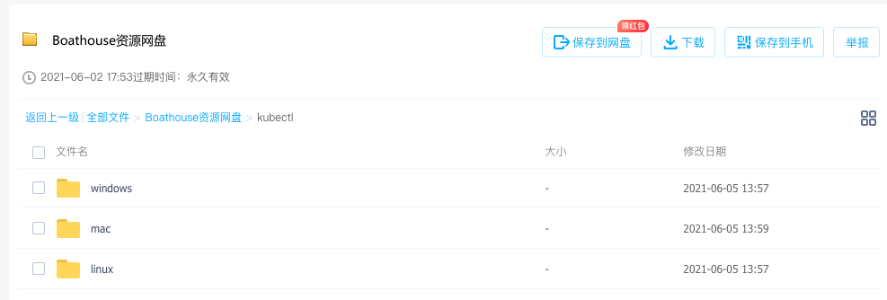
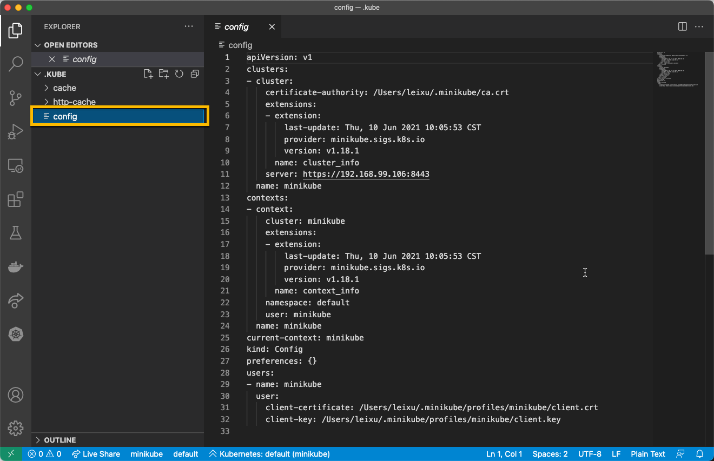
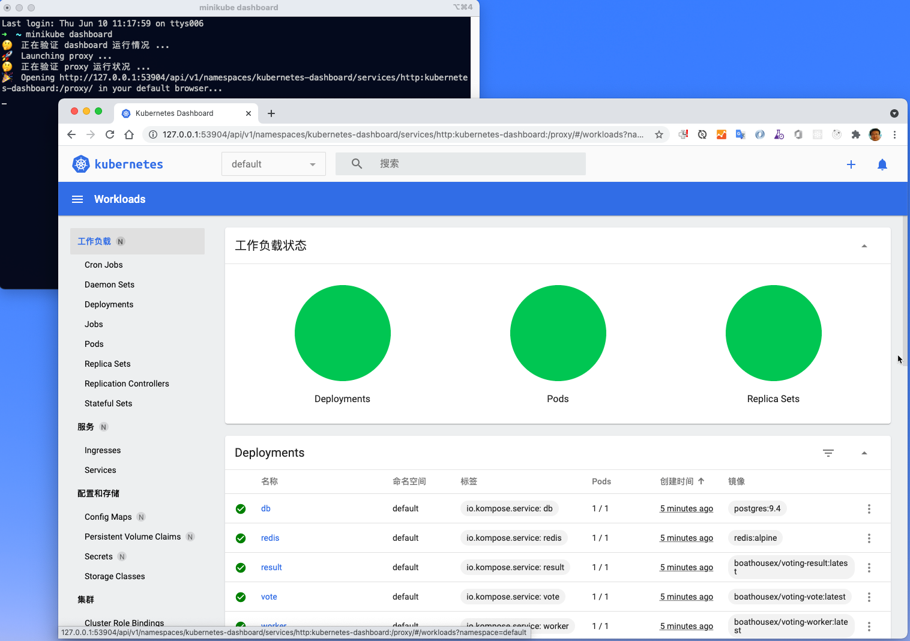
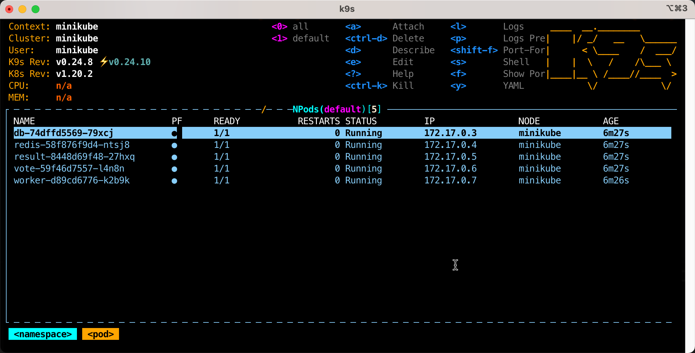
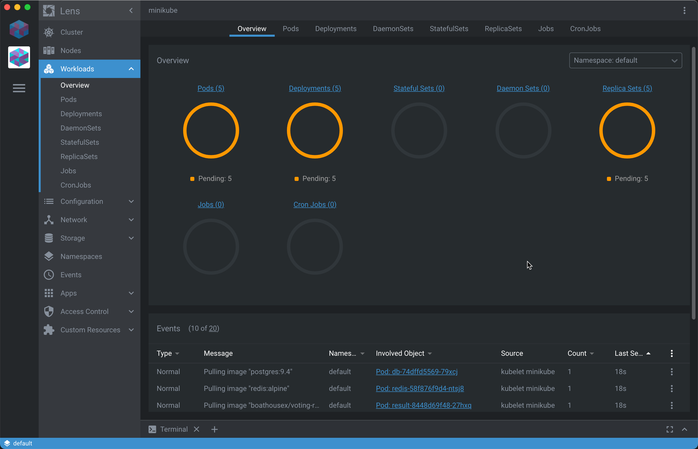

# BHOL401 - 连接到Kubernetes集群及Minikube基础操作

本节实验将带领大家了解如何使用kubectl和其他工具连接到Kubernetes集群以便进行后续的操作。

kubectl是操作k8s集群必备的工具，使用这个工具我们可以完成所有的集群管理和应用部署配置工具。

## 01 - 获取并安装kubectl工具

### 方法1 - 通过minikube获取

按照 DevOpsBox 操作手册安装了minikube之后，可以直接使用以下命令运行kubectl工具。

注意：以下我们使用的是阿里云版本的minikube工具，这个版本真对国内网络进行了优化，可以保证工具的正常下载。如果使用的是谷歌官方版本，可能会应为网络问题无法完成下载。

参考文档：[安装并配置阿里云版MiniKube](../devopsbox/README.md?id=_03-安装并配置阿里云版minikube)

```shell
## 启动 minikube 集群
minikube start
## 运行 kubectl 获取集群节点列表
### 如果是第一此执行，minikube会自动下载并安装kubectl工具
minikube kubectl get nodes
    > kubectl.sha256: 64 B / 64 B [--------------------------] 100.00% ? p/s 0s
    > kubectl: 44.09 MiB / 44.09 MiB [-------------] 100.00% 959.84 KiB p/s 47s
NAME       STATUS   ROLES                  AGE   VERSION
minikube   Ready    control-plane,master   26h   v1.20.2
```

### 方法2 - 直接安装

kubectl的官方仓库地址：https://github.com/kubernetes/kubectl

如果需要最新版本，可以通过以上仓库中的release列表自行下载安装。

以下列出 Linux / Mac / Windows 上的自动安装方式

**Linux**

```shell
## Linux 上安装最新版的脚本
curl -LO "https://dl.k8s.io/release/$(curl -L -s https://dl.k8s.io/release/stable.txt)/bin/linux/amd64/kubectl"
### 如果需要安装特定版本，可以将以上命令中的$(curl -L -s https://dl.k8s.io/release/stable.txt)部分替换成特定的版本号，比如：v1.21.0，形成一下特定版本的安装脚本
curl -LO "https://dl.k8s.io/release/v1.21.0/bin/linux/amd64/kubectl"
```
**MacOS**

```shell
## MacOS Intel 芯片电脑 安装最新版本脚本
curl -LO "https://dl.k8s.io/release/$(curl -L -s https://dl.k8s.io/release/stable.txt)/bin/darwin/amd64/kubectl"
chmod +x kubectl
### 如果需要安装特定版本，可以将以上命令中的$(curl -L -s https://dl.k8s.io/release/stable.txt)部分替换成特定的版本号，比如：v1.21.0，形成一下特定版本的安装脚本
curl -LO "https://dl.k8s.io/release/v1.21.0/bin/darwin/amd64/kubectl"

## MacOS ARM 芯片电脑 安装最新版本脚本
curl -LO "https://dl.k8s.io/release/$(curl -L -s https://dl.k8s.io/release/stable.txt)/bin/darwin/arm64/kubectl"
chmod +x kubectl
### 如果需要安装特定版本，可以将以上命令中的$(curl -L -s https://dl.k8s.io/release/stable.txt)部分替换成特定的版本号，比如：v1.21.0，形成一下特定版本的安装脚本
curl -LO "https://dl.k8s.io/release/v1.21.0/bin/darwin/arm64/kubectl"
```

**Windows**

下载地址如下：https://dl.k8s.io/release/v1.21.0/bin/windows/amd64/kubectl.exe

下载后配置好PATH即可。


### 方法3 - 通过 Boathouse 资源网盘安装

按照 [Boathouse资源网盘](README?id=boathouse-资源网盘) 获取网盘地址

从以下目录中选取适合自己的版本，放置到自己的位置，配置好PATH即可。




## 02 - KubeConfig 配置文件

kubectl工具通过 KubeConfig 配置文件连接到 k8s 集群，这个文件一般保存在当前用户的 .kube 目录中，使用vscode打开这个目录可以看到如下内容:



以上是一个典型的通过minikube创建的 KubeConfig 文件，这个文件的默认地址为 .kube/config。其中的几个关键信息

- certificate-authority : 集群证书
  - certificate-authority-data : 如果直接将证书内容放置在 config 文件中，则使用这个配置
- server : 集群api地址
- name : 集群名称
- client-certificate : 用户证书
  - client-certificate-data : 如果直接将证书内容放置在 config 文件中，则使用这个配置
- client-key : 用户私钥
  - client-key-data : 如果直接将证书内容放置在 config 文件中，则使用这个配置

可以通过kubectl同时管理多个集群，这时可以通过 context 切换当前所操作的集群

```shell
## 获取当前 kubectl 可以操作的集群资源
kubectl config get-contexts
CURRENT   NAME                 CLUSTER              AUTHINFO                                       NAMESPACE
*         ads-agents-cluster   ads-agents-cluster   clusterUser_rg-ads-agents_ads-agents-cluster
          minikube             minikube             minikube                                       default
## 切换至 minikube 
kubectl config use-context minikube
Switched to context "minikube".
## 显示当前所使用的集群
kubectl config current-context
minikube
```

## 03 - k8s 常用工具

### Dashboard

Dashboard 是 k8s 内置的 WebUI，可以帮助你查看和管理集群资源。

```shell
## 使用minikube启动dashboard
### 注意：启动dashboard之后会独占terminal窗口，建议打开新窗口运行此命令
minikube dashboard
```

Dashboard启动后效果如下：



### k9s

k9s是一款基于terminal的k8s监控管理工具，可以通过terminal窗口查看和管理大多数k8s集群的功能。

官网地址：https://k9scli.io/

按照官方说明安装后，在 terminal 中键入 k9s 即可连接到当前的KubeConfig Context所指向的集群，效果如下



### Lens

Lens 是一个桌面程序，可以连接到k8s集群查看管理集群资源，同时支持直接连接pod的terminal，方便我们调试k8s应用。

官方地址：https://k8slens.dev/

安装好之后，在Add Cluster中指定你所要使用的KubeConfig文件，Lens即可连接到集群。效果如下：



## 小结

本节内容帮助你开始你的k8s开发，对于后续的操作是基础性内容。


