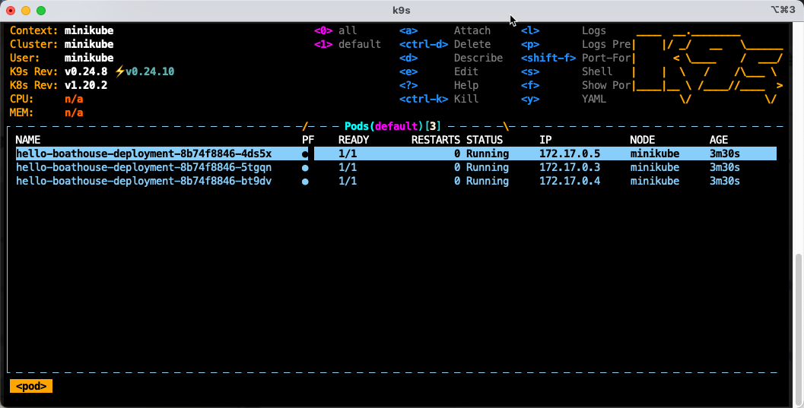
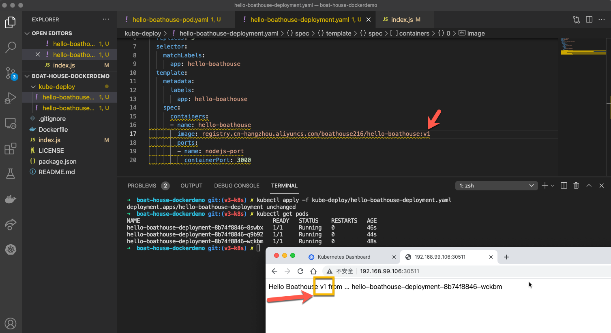
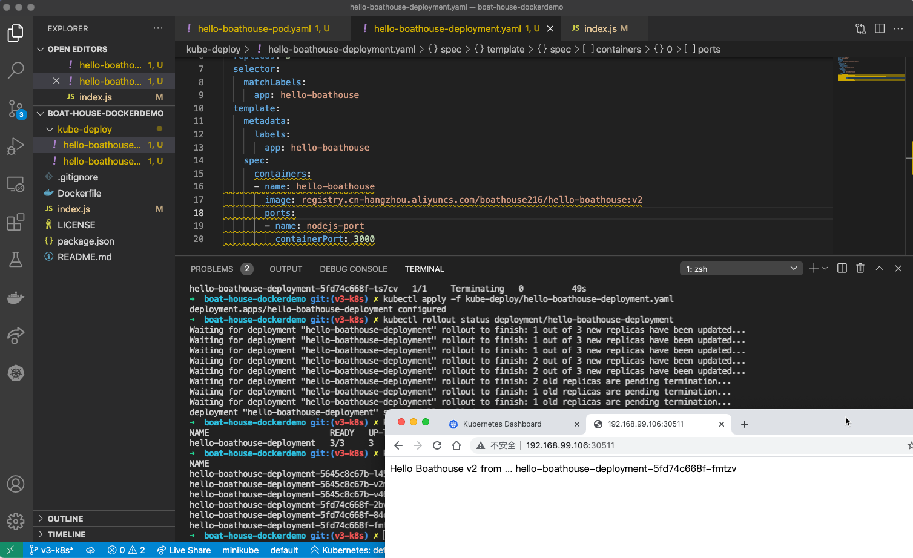
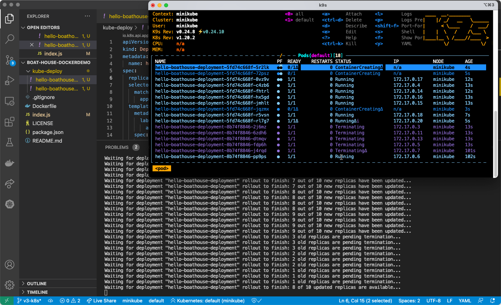

# BHOL403 - k8s应用开发部署 - 使用deployment进行部署

在这几节实验中，我们将完成我们的 Hello Boathouse 应用的k8s部署过程，其中会涉及到一下k8s中的对象

- Pod
- * Deployment
- Service
- Secret
- Namespace

这些内容基本上覆盖了我们k8s集群进行应用开发部署的主要对象。

## 05 - 使用 Deployment 进行部署

使用pod部署每次只能部署一个pod，无法对我们的应用进行阔缩容设置。使用 Deployment，我们不仅可以同时启动多个pod，还可以管理应用的升级，回滚和阔缩容设置。

首先清理我们刚才用pod方式进行的部署

```shell
kubectl delete service hello-boathouse-service
kubectl delete pod hello-boathouse-pod
```

## 部署 hello-boathouse v1 版本

注意：为了简化大家的操作，下面我们都统一使用讲师提供的公开镜像，如果需要更换成自己的镜像，注意替换一下 boathouse216 为你自己的命名空间即可。

使用vscode创建 hello-boathouse-deployment.yaml 文件，内容如下

```yaml
apiVersion: apps/v1
kind: Deployment
metadata:
  name: hello-boathouse-deployment
spec:
  replicas: 3
  selector:
    matchLabels:
      app: hello-boathouse
  template:
    metadata:
      labels:
        app: hello-boathouse
    spec:
      containers:
      - name: hello-boathouse
        image: registry.cn-hangzhou.aliyuncs.com/boathouse216/hello-boathouse:v1
        ports:
        - name: nodejs-port
          containerPort: 3000
```

使用以下命令完成部署

```shell
## 进行部署
kubectl apply -f kube-deploy/hello-boathouse-deployment.yaml
## 获取 部署deployment 状态
kubectl get deployments
NAME                         READY   UP-TO-DATE   AVAILABLE   AGE
hello-boathouse-deployment   3/3     3            3           6m49s
## 获取 扩容集Replica Sets 状态 
kubectl get rs         
NAME                                   DESIRED   CURRENT   READY   AGE
hello-boathouse-deployment-8b74f8846   3         3         3       6m52s
## 获取 pod 状态
kubectl get pods --show-labels
NAME                                         READY   STATUS    RESTARTS   AGE    LABELS
hello-boathouse-deployment-8b74f8846-4ds5x   1/1     Running   0          7m8s   app=hello-boathouse,pod-template-hash=8b74f8846
hello-boathouse-deployment-8b74f8846-5tgqn   1/1     Running   0          7m8s   app=hello-boathouse,pod-template-hash=8b74f8846
hello-boathouse-deployment-8b74f8846-bt9dv   1/1     Running   0          7m8s   app=hello-boathouse,pod-template-hash=8b74f8846
## 获取 发布rollout 状态
kubectl rollout status deployment/hello-boathouse-deployment
deployment "hello-boathouse-deployment" successfully rolled out
```

我们也可以通过k9s实时监控集群状态



对外暴露服务以便可以测试

```shell
ubectl expose deployment hello-boathouse-deployment --name hello-boathouse-service --type=NodePort
minikube service hello-boathouse-service --url
```

这时我们就可以通过NodePort访问我们的应用了，注意现在应用显示v1版本



## 升级到 hello-boathouse v2 版本

现在我们对 hello-boathouse-deployment.yaml 做一个修改，将镜像版本修改为 v2

```yaml
## 修改第17行为
image: registry.cn-hangzhou.aliyuncs.com/boathouse216/hello-boathouse:v2
```

再次提交部署

```shell
## 进行部署
kubectl apply -f kube-deploy/hello-boathouse-deployment.yaml
## 检查部署状态
kubectl get deployments
## 检查 rollout 状态
kubectl rollout status deployment/hello-boathouse-deployment
## 检查 pod 状态
kubectl get pods
```

我们可以看到部署的完成进展情况，k8s使用了滚动部署机制完成我们的版本升级，此时打开浏览器访问服务地址，会发现服务已经升级到v2版本，如果多次刷新，你会发现每次的hostname会发生变化，这时因为现在我们有3个pod在为这个站点提供服务。



## 版本回滚

使用以下命令获取部署历史记录，并进行回滚

```shell
## 获取部署历史记录
kubectl rollout history deployment/hello-boathouse-deployment
deployment.apps/hello-boathouse-deployment 
REVISION  CHANGE-CAUSE
3         <none>
5         <none>
6         <none>
## 回滚到上一个版本
kubectl rollout undo deployment/hello-boathouse-deployment
## 查看回滚状态
kubectl rollout status deployment/hello-boathouse-deployment
## 回滚到特定版本
kubectl rollout undo deployment/hello-boathouse-deployment --to-revision=3
```

## pod扩容

现在我们对 hello-boathouse-deployment.yaml 做一个修改，将副本数量修改为10

```yaml
## 修改第6行
  replicas: 10
```

提交部署

```shell
## 进行部署
kubectl apply -f kube-deploy/hello-boathouse-deployment.yaml
## 检查部署状态
kubectl get deployments
## 检查 rollout 状态
kubectl rollout status deployment/hello-boathouse-deployment
## 检查 pod 状态
kubectl get pods
```

使用k9s监控部署状态



