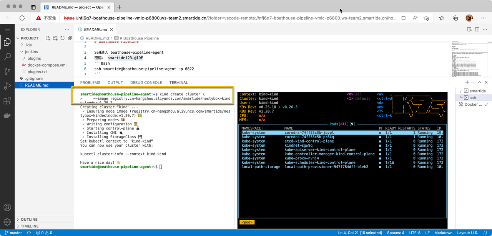
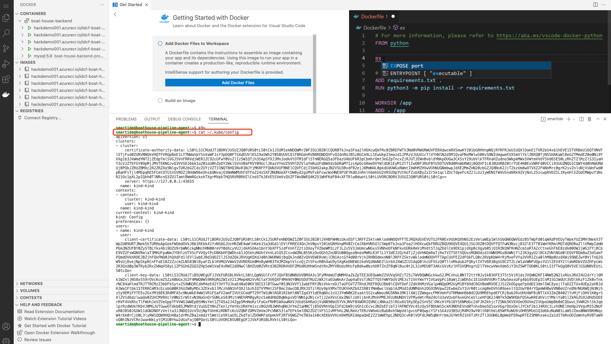
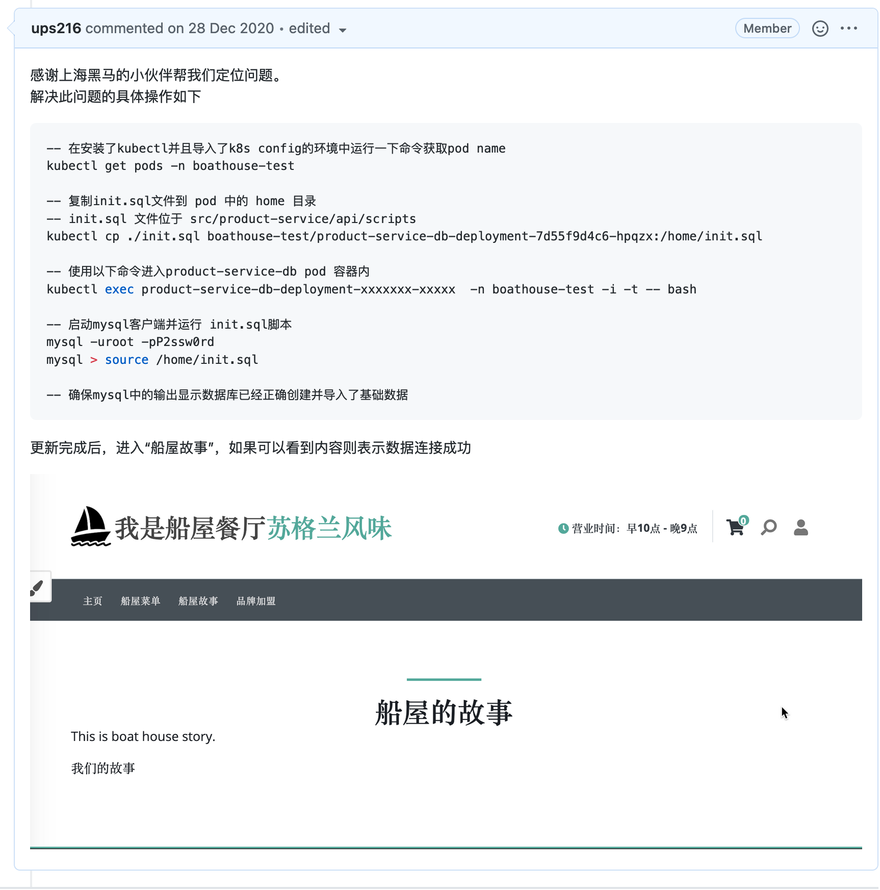
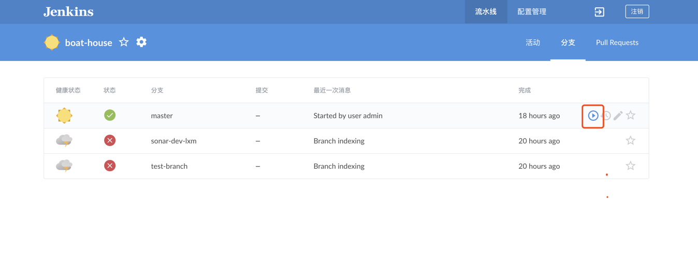
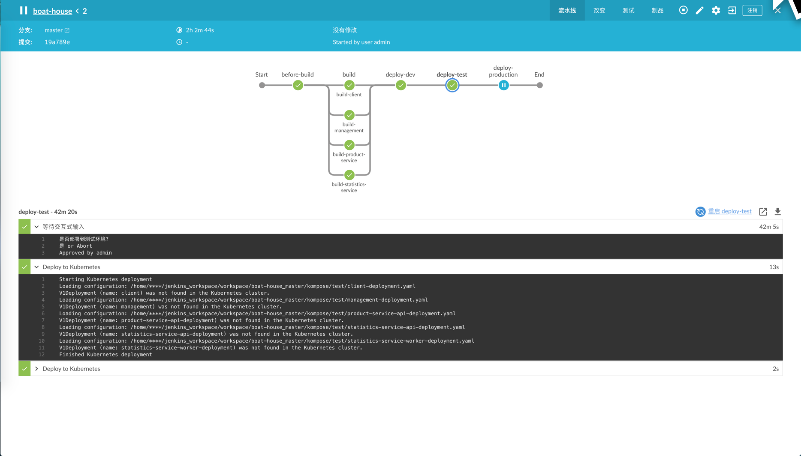
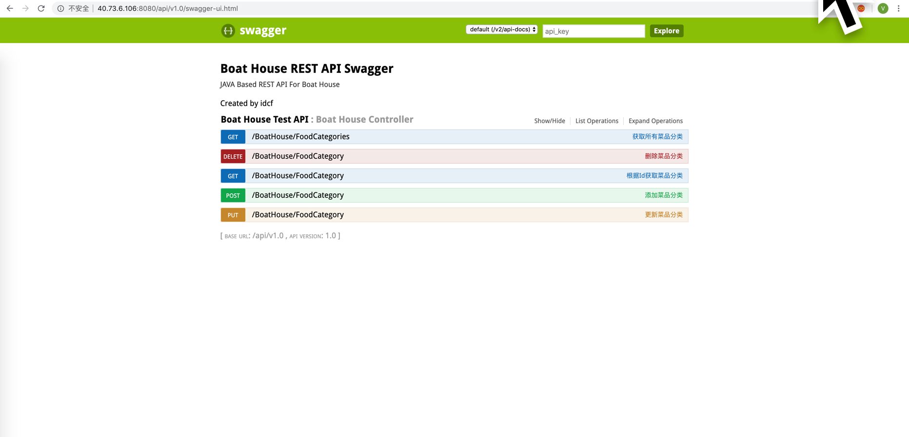
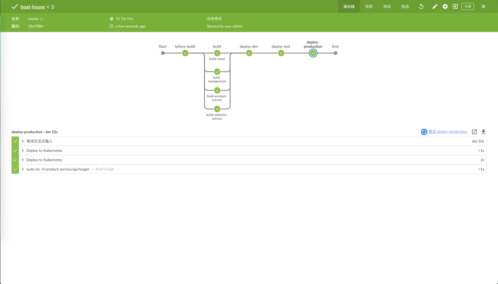
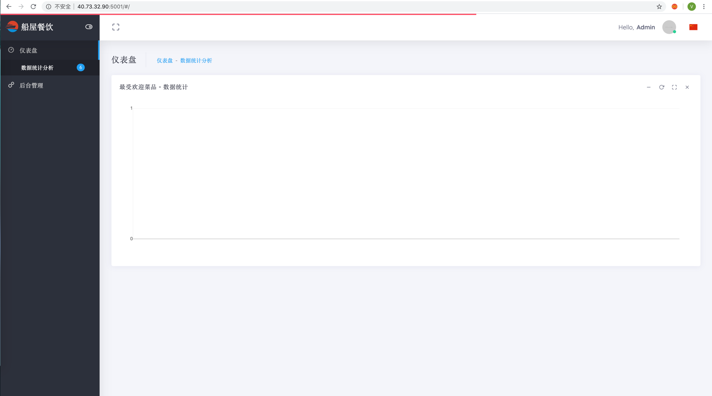

# Boathouse K8S (Test & Prod) 环境部署

在前面的文档中，我们已经部署好 Jenkins 的流水线，并成功的部署了 Boathouse 的 Dev 环境。
接下来，我们会使用已分配给团队的K8S环境部署 Boathouse 的 Test 环境.

## 准备部署环境（快速创建K8S集群）

我们将使用 boathouse-pipeline-agent 这个资源作为我们的测试环境 ，会通过在这个资源内运行一个k8s集群。

执行以下命令快速创建一个K8S集群：

```
# 首先进入到boathouse-pipeline-agent资源空间，密码root123
ssh smartide@boathouse-pipeline-agent -p 6822

# 使用KIND创建单节点k8s集群
kind create cluster \
    --image registry.cn-hangzhou.aliyuncs.com/smartide/nestybox-kindestnode:v1.20.7
```

k8s集群创建成功后，可以使用k9s工具对集群运行状态进行实时监控。

  


接下来可以为应用创建一个独立的命名空间，执行如下命令：


```shell
kubectl create namespace boathouse-test
```

    
   
为命名空间创建 docker-registry-secrets

> 容器镜像仓库的用户名和密钥联系讲师获取。

- 用于Jenkins流水线部署

```shell
## [docker registry url] 是容器镜像服务ACR的地址
## [username] 是容器镜像服务ACR的用户名
## [password] 是容器镜像服务ACR的密码
kubectl create secret docker-registry regcred --docker-server=[docker registry url] --docker-username=[username] --docker-password=[password] --docker-email=info@idcf.io -n boathouse-test
```
    
Jenkins 添加 Kubeconfig 凭据,ID需为'creds-test-k8s'，找到kube config文件，将里面的所有内容复制到content中：

```
cat ~/.kube/config 
```

  

Jenkins流水线使用 Kubernetes Continues Deploy 插件完成k8s部署，此插件需要一个叫做 creds-test-k8s 的凭据以便可以获取k8s的访问密钥。
    


注意：ID 字段同我们的 K8s 部署 yaml 对应，以此默认需要写为 creds-test-k8s

**重要提示：** 当前的k8s环境部署脚本存在一个缺陷，在部署完成后端系统后不会自动创建所需要的数据库实例，这会造成后台api工作不正常。请参考一下 issue 中的说明暂时性修复此问题 https://github.com/idcf-boat-house/boat-house-backend/issues/1

如果无法访问github.com请参考一下截图




至此，Jenkins 和 K8s 的集群配置就完毕了。

## 触发流水线完成测试环境和生产环境部署

### 部署测试环境

代码仓库的yaml文件提交完毕，接下来我们开始进行Jenkins流水线的部署。

1. 打开Jenkins流水线，点击分支重新启动流水线



2. Dev环境部署完毕后，点击同意部署到测试环境


3. 等待测试环境部署完毕，可以看到该步骤执行成功



4. 回到工作空间，使用k9s查看部署情况
    ```
    k9s
    ```


6. 运行以下命令，查看测试环境的 services 列表
    
    ```
    kubectl get services -n boathouse-test
    ```

    
    
    上图中，我们可以看到 client, management, product-service-api 服务均已经启动，外部 IP 地址和端口号也已经可以看到

7. 访问各服务的 IP地址和端口号对应的网站，可以看到环境已经成功在运行中

Client: http://[client-serivce-ip]:[port]


Management: http://[management-serivce-ip]:[port]


Product Service Swagger API: http://[product-serivce-api-ip]:[port]/api/v1.0/swagger-ui.html




### 部署生产环境

1. 打开Jenkins流水线，点击同意部署到生产环境

1. 等待生产环境部署完毕，可以看到该步骤执行成功

1. 回到命令行，查看生产环境命名空间下的 pods
    ```
    kubectl get pods -n boathouse-prod
    ```
    可以看到生产环境已经部署成功
    
1. 查看生产环境 Services
    ```
    kubectl get services -n boathouse-prod
    ```
    
1. 访问生产环境网站



